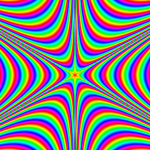
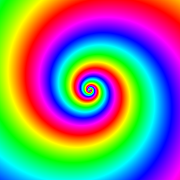

# Imaging

 

This is a library for representing and managing basic raster RGBA images in [D](https://dlang.org/) as rectangular arrays of pixels. It is written in pure D with no external dependencies (other than the standard library).

The goal of this library is to provide a simple, yet versatile, shared representation for, effectively, the most common kind of image in computing, so other libraries may leech upon it, building compatibility and making it a *lingua franca* for images in D, ideal for writing ***glue code***, including with other languages. It aims at supporting other libraries, not replacing them.

Images are represented in row-wise pixel order, either top to bottom (the default) or bottom to top, with each scan line going left to right. Color components are represented as 8-bit integral values ranging between, and including, 0 and 255. Multiple pixel formats are supported.

This library doesn't provide any support for other color models, for high dynamic ranges or higher bit depths, for advanced manipulation or for GPU processing. None is planned. Features that should belong to more specific libraries, rather than to one serving as a basis for others, are out of scope. The library requires garbage collection.

Versioning of this library follows the [SemVer](https://semver.org/) specification.

***This project is a work in progress.***

## Overview

The basic type is the `imaging.Bitmap` class, which represents images through the `getPixel`/`setPixel` API. RGBA colors are represented through the `imaging.Color` union.

Raw pixel data can be accessed directly through the `Bitmap.data` property and can even be shared among different `Bitmap` objects, including to represent different rectangular slices of the same larger image. This, combined with the support of multiple pixel formats, as well as the top-down and bottom-up orders for rows, allows for interfacing this library with existing native libraries with minimal duplication of pixel data.

Advanced codecs that allow great efficiency as well as detailed format-specific inspection and manipulation of image files are better left to specific external libraries. However, some basic codecs for importing and exporting images are provided. The supported formats are:

- The [Windows Bitmap Format](https://learn.microsoft.com/openspecs/windows_protocols/ms-wmf/4813e7fd-52d0-4f42-965f-228c8b7488d2) for device-independent bitmaps.
- The [Portable Network Graphics](https://www.libpng.org/pub/png/) format.
- The [Quite Ok Image Format](https://qoiformat.org/).
- The [Icon Format](https://learn.microsoft.com/windows/win32/wic/ico-format-overview), supporting multiple images per file.
- The [Animated PNG](https://wiki.mozilla.org/APNG_Specification) format, supporting animations.

A standard interface for codecs is provided, so that they may be registered for use, such as to link one implemented in an existing library. Codecs registered by the user are prioritized over the provided ones.

## Hacking

This project comes as a [DUB](https://dub.pm/) package of the *library* target type. See the [`dub.sdl`](./dub.sdl) recipe file.

The code is portable to any operating system and compliant D compiler, such as [DMD](https://dlang.org/dmd.html), [GDC](https://gdcproject.org/) and [LDC](https://wiki.dlang.org/LDC).

Documentation can be generated from comments using standard D [documentation generators](https://dlang.org/spec/ddoc.html).

## Phobos

It is an express goal of this project to be absorbed as part of the standard runtime library of the D programming language, [Phobos](https://dlang.org/phobos/).

A shared, standard representation of images would benefit the D community. There is a wide variety of kinds of image in computing and reasons they are used, but raster RGB(A) images are a ubiquitous, commonly understood and used as a starting and destination point even by tools that process other kinds of images.

This means not to be an image library to rule them all, but a common ground to be shared. Having a standard image representation in D would facilitate compatibility between different libraries and provide a familiar form for programmers. It would serve as an obvious starting point for those wishing to write a library that accepts or produces images and as an interface that allows separation of concerns. Additionally, it could be used by development tools, such as visual debuggers capable of displaying images, without the need to include an additional specific library in the program just for debugging purposes.

Most standard libraries, especially rudimentary ones, don't offer a way to represent images. But one notable feature of D is that its standard library is rather rich. Java provides support for images through the [`java.awt.Image`](https://docs.oracle.com/javase/8/docs/api/java/awt/Image.html) and [`java.awt.BufferedImage`](https://docs.oracle.com/javase/8/docs/api/java/awt/image/BufferedImage.html) classes of the [Abstract Window Toolkit](https://docs.oracle.com/javase/8/docs/technotes/guides/awt/) and .NET languages do through the `System.Imaging` namespace and its [`Bitmap`](https://learn.microsoft.com/dotnet/api/system.imaging.bitmap) class. A similar feature has been [proposed](https://peps.python.org/pep-0368/) for Python. The official PHP manual [documents](https://www.php.net/manual/en/refs.utilspec.image.php) extensions for image processing and generation.

This library is much leaner and more basic than other image libraries. It sits at a nice point of balance where, once stabilized, it should be easy to maintain. Certain other assets, such as fonts, audio, videos, vector images and 3D model are, at once, more complex, less common, less useful to standardize and more varied in their landscape. Their inclusion in a standard library wouldn't be justified, but that of images is, as it provides a much greater benefit for a much lower cost.

The project should aim at reaching a level of quality sufficient for inclusion in Phobos. Adoption prior to that point, as it would also encourage approval.

## Contributing

Contributions that improve the library and are consistent with this section are welcome!

Development of Imaging happens on its GitHub repository. Communications happens in English and development should follow [GitHub flow](https://docs.github.com/en/get-started/using-github/github-flow).

This project conforms to the [D Style](https://dlang.org/dstyle.html) conventions, as well as the [additional requirements for Phobos](https://dlang.org/dstyle.html#phobos).

Code should be formatted through [dfmt](https://code.dlang.org/packages/dfmt) with default settings. All imports should be selective and import blocks should be sorted alphabetically.

The [EditorConfig](https://editorconfig.org/) [`.editorconfig`](./.editorconfig) file is used by dfmt and may be used by your editor.

In descending order of importance, code should be *correct*, *efficient*, *versatile*, *idiomatic* and *readable*.

Do not introduce any new code in programming languages other than D, any new dependency, any new technical requirement or any new legal or technical restriction or requirement.

**Contributions must not include content generated, in part or in full, by large language models, generative models or similar systems.** This policy covers code, documentation, pull requests, issues, comments, commit messages and anything else sent to the project. Contributors are expected to understand their submissions.

Any contribution submitted for inclusion by you shall be under the terms and conditions of the project's license, without any additional terms or conditions. By making a contribution, you certify that you have the right to submit it under this license.

## Examples

The [`examples`](./examples/) directory contains some examples, as it should, given its name.

The contents of the [`examples/images`](./examples/images) directory need to be cloned from the designated [repository](https://github.com/Aspie96/Imaging-exsample-images). This is so as to spare mere users of the library from downloading test images.

The [`examples/window.h`](./examples/window.h) file and the images and collections in (the repository for) the [`examples/images`](./examples/images) are third-party assets.

## License

Everything in this project, except for the [`examples`](./examples) and the contents of the [`examples/images`](./examples/images) directory, which come from third parties and belong to their respective owners, is released under the Boost Software License, Version 1.0.

Any contribution submitted for inclusion by you shall be under the terms and conditions of the project's license, without any additional terms or conditions. By making a contribution, you certify that you have the right to submit it under this license.

This software is provided "as is", without warranty of any kind, express or implied, including but not limited to the warranties of merchantability, fitness for a particular purpose, title and non-infringement. in no event shall the copyright holders or anyone distributing the software be liable for any damages or other liability, whether in contract, tort or otherwise, arising from, out of or in connection with the software or the use or other dealings in the software.
